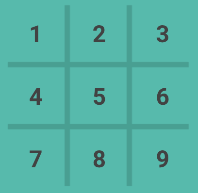

# CSCI 357 Final Project

Bucknell University

Spring 2021

## Group members
* Christina Yu
* Ian Herdt
* Lawrence Li
* Steven Iovine

## Group name: Tic Tac Toe Tac Tic

## Project description

This project seeks to predict human behavior in the game of tic tac toe. 
More specifically, this project is interested in creating a neural network that is able to predict user decision-making based on their previous behavior. 
To train the network, a large number of training games must be played between AI and human player, which can predict human behaviors in the context of the game.

The project chooses the long short-term memory neural network, which can learn order dependence in sequence prediction problems, 
and connect past action sequences to predict the next action. 
One strength of LSTM networks is that they can remember information for long periods of time, 
which is suitable for the game like tic tac toe where the network needs to remember lots of opponent’s actions to predict the next move, 
and hence predicting the human behavior. 

## Running the Project

### Required library

Install the following libraries using ```pip install```

```numpy keras tensorflow```

### Instructions to run the program

1. Open a terminal and ```cd``` to this repository
2. ```cd src``` and run ```python main.py``` 
3. A human readable game board is printed, alongside with a numpy array representation of that array.
   An example is shown here:

   
   
   You will also see the prediction printed like this:
   
   
   
   The format of prediction represented a tic tac toe board with each slot containing a likeliness score.
   Numbers are from range 0 to 1: 0 is not likely, 1 is most likely
   
4. You can play the tic tac toe game by entering the number from 1 to 9. 
   Each number represents a slot in the tic tac toe shown as the following:

   
   
   You are playing against a computer player.
   
5. The computer will now randomly select a slot to play and an updated, human readable game board is printed.
   You will play against the computer until conditions are met. 
6. When the game is finished, you can choose to train the agent by entering ```y``` or ```n```
   If you pressed ```y``` to train, then you will also be prompted to save the model to disk. We recommend to save it for future use.
7. You can also choose to play the game again by entering ```y``` or ```n```. Program will exit if you enter ```n```.

